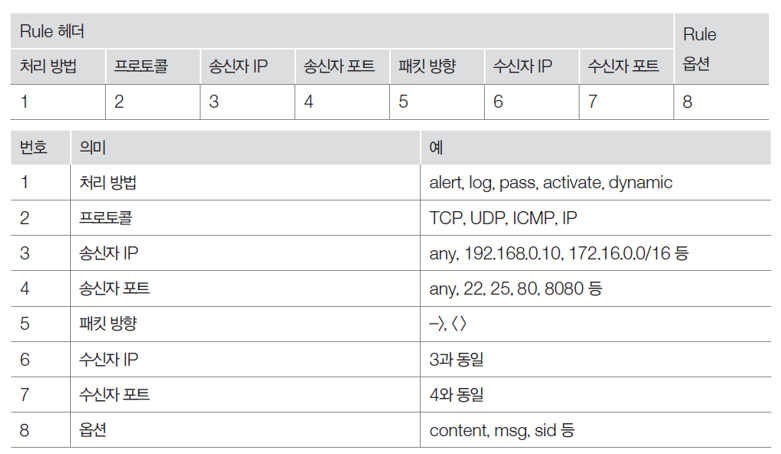

메모리 4기가, cpu 2

hacker/dkagh1.


## 보안 솔루션 설치

#### 스노트 설치

네트워크 어댑터 설정: sudo vi /etc/network/interfaces 실행 후 다음 내용을 하단에 추가

```
post-up ethtool -k ens33 gro off
post-up ethtool -k ens33 lro off       #off 안하면 패킷 캡쳐시 가공된 패킷이 캡쳐됨
```


필수 패키지 설치(에러나면 재부팅후 다시)

```
sudo apt install -y build-essential libpcap-dev libpcre3-dev libdumbnet-dev bison flex openssl zlib1g-dev liblzma-dev libssl-dev
```


DAQ 다운로드 및 설치(snort 관련 유틸 추가 설치)

```
wget https://www.snort.org/downloads/snort/daq-2.0.6.tar.gz
tar xvzf daq-2.0.6.tar.gz
cd daq-2.0.6
./configure && make && sudo make install
```


스노트 다운로드 및 설치

```
wget https://www.snort.org/downloads/archive/snort/snort-2.9.11.1.tar.gz
tar xzvf snort-2.9.11.1.tar.gz
cd snort-2.9.11.1
./configure --enable-sourcefire && make && sudo make install
```


공유 라이브러리 업데이트 및 실행 확인

```
sudo ldconfig #공유 라이브러리 캐시를 다시 설정(업데이트된 공통라이브러리를 다시 동적 연결하기위해)
sudo ln -s /usr/local/bin/snort /usr/sbin/snort
snort -V
```


폴더 생성 및 권한 설정: 터미널에서 다음 명령어 실행(설정 및 룰 세팅 폴더 별도 생성)

```
# snort 사용자 및 그룹 생성:
sudo groupadd snort
sudo useradd snort -r -s /sbin/nologin -c SNORT_IDS -g snort
# snort 디렉토리 생성:
sudo mkdir /etc/snort
sudo mkdir /etc/snort/rules
sudo mkdir /etc/snort/rules/iplists
sudo mkdir /etc/snort/preproc_rules
sudo mkdir /usr/local/lib/snort_dynamicrules
sudo mkdir /etc/snort/so_rules
# rule 및 ip 목록 저장을 위한 기본 파일 생성:
sudo touch /etc/snort/rules/iplists/black_list.rules
sudo touch /etc/snort/rules/iplists/white_list.rules
sudo touch /etc/snort/rules/local.rules
sudo touch /etc/snort/sid-msg.map
#로깅 디렉토리 생성:
sudo mkdir /var/log/snort
sudo mkdir /var/log/snort/archived_logs
# 권한 조정:
sudo chmod -R 5775 /etc/snort
sudo chmod -R 5775 /var/log/snort
sudo chmod -R 5775 /var/log/snort/archived_logs
sudo chmod -R 5775 /etc/snort/so_rules
sudo chmod -R 5775 /usr/local/lib/snort_dynamicrules
sudo chown -R snort:snort /etc/snort
sudo chown -R snort:snort /var/log/snort
sudo chown -R snort:snort /usr/local/lib/snort_dynamicrules
```


설치 폴더에서 기본 파일 복사

```
cd ~/Desktop/snort-2.9.11.1/etc/

sudo cp *.conf* /etc/snort
sudo cp *.map /etc/snort
sudo cp *.dtd /etc/snort

cd ~/Desktop/snort-2.9.11.1/src/dynamic-preprocessors/build/usr/local/lib/snort_dynamicpreprocessor/

sudo cp * /usr/local/lib/snort_dynamicpreprocessor/
```


스노트 설정 파일 수정: sudo vi /etc/snort/snort.conf 실행 후 다음과 같이 내용 수정

547번 이후로는 모두 삭제(실습자가 만든 룰만 적용할 예정)

```
:set number

104 var RULE_PATH /etc/snort/rules
105 var SO_RULE_PATH /etc/snort/so_rules
106 var PREPROC_RULE_PATH /etc/snort/preproc_rules
107
112 # Set the absolute path appropriately
113 var WHITE_LIST_PATH /etc/snort/rules/iplists
114 var BLACK_LIST_PATH /etc/snort/rules/iplists
...
546 include $RULE_PATH/local.rules
```


동작 테스트를 위한 룰셋 작성(ping 탐지): 아래 룰셋을 /etc/snort/rules/local.rules 파일에 기록

```
alert icmp any any -> $HOME_NET any (msg:"ICMP detected"; sid:1000001; rev:001; classtype:icmp-event;)

#스노트룰은 룰헤더와 룰옵션으로 나뉜다.
#msg 경고 이벤트를 보여줄 때 나타나는 메시지
#sid rule의 id
#rev 현재 rule의 개정 버전
#classtype rule을 범주화
```


설치 완료 검증: 다음 명령어 실행 후 앞서 설정한 윈도우 가상머신에서 ping 20.20.20.1을 실행 시 스노트를 실행한 터미널 화면에 ICMP alert이 잘 찍히는지 확인

```
sudo /usr/local/bin/snort -A console -q -u snort -g snort -c /etc/snort/snort.conf -i ens33
```


#### 스노트 최신 룰셋 다운로드 및 적용

스노트 홈페이지 가입 후 구독하여 Oinkcode를 획득한다. 이후 https://www.snort.org/downloads/#rule-downloads에 접속해 최신 룰셋 파일 버전을 확인한다.


룰셋 다운로드

```
wget https://www.snort.org/rules/snortrules-snapshot-29151.tar.gz?oinkcode=1407e...(34)...c763ce -O snortrules.tar.gz
```


스노트 압축해제 및 룰셋 파일 적용

```
sudo tar xzvf snortrules.tar.gz -C /etc/snort
cd /etc/snort/etc
sudo cp ./*.conf* ../
sudo cp ./*.map ../
cd /etc/snort
sudo rm -Rf /etc/snort/etc
```


스노트 설정 파일 수정: sudo vi /etc/snort/snort.conf 실행 후 다음과 같이 내용 수정

unified2는 로그저장하는 snort 고유 파일 형식

```
104 var RULE_PATH /etc/snort/rules
105 var so_RULE_PATH /etc/snort/so_rules
106 var PREPROC_RULE_PATH /etc/snort/preproc_rules
107
108 # If you are using reputation preprocessor set these
109 var WHITE_LIST_PATH /etc/snort/rules/iplists
110 var BLACK_LIST_PATH /etc/snort/rules/iplists
517 # unified2
518 # Recommended for most installs
519 output unified2: filename merged.log, limit 128, nostamp, mpls_event_types, vlan_event_types
520
521 # Additional configuration for specific types of installs
522 output alert_unified2: filename snort.alert, limit 128, nostamp
523 output log_unified2: filename snort.log, limit 128, nostamp
524
...
544 include $RULE_PATH/local.rules
```


스노트 룰셋 적용 확인

```
sudo snort -T -c /etc/snort/snort.conf -i ens33
```
*  -T : test 모드


## 스노트 룰

스노트 룰은 크게 헤더와 옵션으로 구성된다.



#### 룰 헤더

스노트가 패킷을 수집하는데 있어서 필수적인 기준을 명시해놓은 부분

```
# 스노트 룰 구조

	[action] [송신자 IP Address] [송신자 Port] [Direction] [수신자 IP Address] [수신자 Port]

	ex) alert tcp 192.168.0.7 any -> 192.168.0.9 80
	ex) log tdp any any <> any 53
```

- **action (패킷이 탐지되었을때 처리 방법)**

  - alert : 경고를 발생시키고, 패킷을 기록

  - log : 패킷을 기록

  - pass : 패킷을 무시

  - activate : 경고를 발생시키고, 대응하는 dynamic 시그니처를 유효하게 함

  - dynamic : activate 시그니처에 의해 유효하게 된 경우 한쪽의 패킷을 기록

  - drop : 패킷을 차단하고 로그를 기록(IDS가 인라인 방식 설치인 경우)

  - reject : 패킷을 차단하고 로그를 기록한 다음 TCP 프로토콜인 경우 TCP reset 패킷을 보냄. UDP 인경우 ICMP Port unreachable 메시지를 보냄

    

- **protocol**

  - tcp / udp / icmp / ip 중 선택

    

- **IP Address**

  - `"!"` 사용 시, NOT 의 의미를 가짐

  - 여러 IP 주소를 지정하는 경우, `","` 로 구분

  - `"any"` 사용 시, 모든 IP 주소 사이의 패킷이 대상이 됨

    

- **Port**

  - `"!"` 사용 시, NOT 의 의미를 가짐

  - `":"` 사용 시, 포트 범위를 지정 가능 ("," 일 수도 있음, 확인 필요)

  - `"any"` 사용 시, 모든 Port 사이의 패킷이 대상이 됨

    

- **Direction**

  - `"->"` 사용 시, 좌측이 송신자 IP 주소
  - Direction 에서 `"<>"` 인 경우 송수신자 구별없이 지정한 IP 주소 사이의 모든 패킷이 대상이 된다.

#### 룰 옵션

룰 옵션은 룰 헤더 뒤의 `"( )"` 안에 정의된 내용 `;(세미콜론)` 으로 옵션을 구분함

- **msg** : 경고 이벤트를 보여줄 때 나타나는 메시지

- **dsize** : 패킷의 크기. 사이즈의 범위나 상하한을 지정할 수 있다.

- **classtype** : 룰을 범주화할때 사용(예시 : 이런 룰은 web-application-attack 클래스에 속한다.)
	
- classification.config 파일에 class가 정의되어 있다.(shortname,short description,priority)
	
- **priority** : 심각도 수준을 룰에 지정(1~10, 숫자가 낮을수록 심각도가 높음)

- **content** : 가장 중요한 룰 옵션으로, 패킷의 페이로드 내부를 검색하는 문자열을 지정한다.

  - 텍스트인 경우 : content:”/bin/sh”;
  - 바이너리인 경우 : content:”|00 6B 40 FF|”;
  - 혼합시킨 경우 : content:”GET|20|/login|2e|php”;
  - HTTP 옵션과 함께 사용시 content 옵션 값이 탐색할 범위를 HTTP 영역으로 한정시킬수 있다.
    - 예 : content:"GET"; http_method; http 메소드 영역에서 탐지
    - content:".\<script>"; http_uri; http uri 영역에서 탐지
    - content:"43wef"; http_cookie; 쿠키 값 탐지
    - content:"KEEP-ALIVE"; nocase; http_header; http 헤더 영역에서 탐지
    - content:"hacker"; http_client_body;  클라이언트 request에서 http body 영역에서 탐지, 즉 POST 메소드의 전송 값 탐지                                                                  
    - content:"404"; http_stat_code;
    - content:"Mozilla/5.0"; http_user_agent;

  ```
  · content 사용 불가 기호는 다음과 같다. 만약, 사용하고자 한다면 escape 기호("\")를 사용해야 함
  	- ;(세미콜론)
  	- \(역슬래쉬)
  	- "(쌍따옴표)
  ```

  

- **offset ~ depth** : 페이로드에서 패턴 매칭 시작 위치 및 끝 위치를 지정한다.

  ```
  패턴 페이로드 : GET /login.php HTTP/1.1
  매칭 버퍼 : GET /
    
  ex ) (msg:"test"; content:"GET"; offset:0; depth:5; sid:1;)
  ```

  

- **distance ~ within** : 이전 content 에 매칭된 경우, 패턴 매칭 시작할 **상대** 위치와 끝 낼 **상대** 위치를 지정한다.

  ```
  패턴 페이로드 : GET /login.php HTTP/1.1
  매칭 버퍼 : /login.php
    
  ex ) (msg:"test"; content:"GET|20|"; content:"/login|2e|php"; distance:0; within:10; sid:1;)
  ```

  

- **nocase** : 대/소문자 구분하지 않는다.

  

- **fast_pattern** : longest pattern 지정

  - 기본적으로 스노트는 content 에 입력한 패턴 중 가장 긴 content 를 “longest pattern” 이라 부른다. 탐지엔진에서는 이러한 패턴들을 모아 Aho-Corasick 알고리즘에 의해 빠르게 검사해야할 시그니처를 걸러낸다.

    패턴의 길이는 짧지만 유니크한 패턴이 존재한다면, 해당 패턴을 Keyword 로 설정하는 것이 성능 향상에 도움이 된다.

    > 보통 패턴의 길이가 길면 다른 패턴과 중복되지 않고 유니크한 경우가 많음

    

- **sid** : 규칙을 구분하는 일종의 ID(식별자)

  - 0 - 99 : 고유 목적을 위해 예약됨
  - 100 ~ 1000000  공식 배포한 rule의 sid
  - 1000000~  사용자 rule의 sid

  

- 그 외도 수많은 옵션이 존재함

  

#### 스캔 탐지, DOS 공격 탐지 룰 제작 실습

**스노트에서는 `"threshold"` 옵션을 이용해 스캔 및 DoS 공격을 효과적으로 탐지/차단할 수 있다.**

```
#룰셋은 /etc/snort/rules/local.rules 파일에 기록

# threshold format

threshold:type <limit|threshold|both>, track <by_src|by_dst> count <s>, seconds <m>

# 하프오픈 스캔 탐지
alert tcp any any -> any any (msg:"SYN Scan Check"; flags:S; threshold:type both, track by_src,count 10, seconds 10; sid:1000001;)
	=> '10초당 10번의 SYN 패킷이 발생시' alert(탐지)

# SYN flooding 탐지 (hping3 [ip] -S --flood --rand-source -p 80)

alert tcp any any -> any 80 (msg:"SYN Flooding Detection"; flags:S; threshold:type threshold, track by_dst, count 3000, seconds 2; sid:10000002;)
	=> 2초 동안 3,000개의 SYN 패킷이 웹서비스에 발생시 alert(탐지)
	
# NMAP XMAS Scan ($HOME_NET은 snort.conf에 설정되어 있다.) (nmap -sX [ip])
alert tcp any any -> $HOME_NET any (msg:"NMAP XMAS"; flags:FPU; sid:1000003; rev:1;)

# ICMP flooding (hping3 [ip] -1 --flood)
alert icmp any any -> $HOME_NET any (msg:"ICMP Flooding"; threshold:type both, track by_src, count 3000, seconds 2; sid:1000004; rev:1;)

# UDP flooding -> 위와 동일한 방식으로 가능

#Land Attack
alert ip any any -> $HOME_NET any (msg:"Land Attack"; sameip; sid:1000005;)


# snort 동작시키고 룰이 잘 동작하는지 확인
sudo /usr/local/bin/snort -A console -u snort -g snort -c /etc/snort/snort.conf -i ens33
```

- **threshold:type**

  - limit : 매 m초 마다 s 번째 이벤트까지 action 수행 (임계 시간 내 로그 발생)

    -> m이 3이고 s가 2면  로그가 2번발생하고 3초후에 다시 로그가 2번 발생하는 형태

  - threshold : 매 m초 동안 s번째 이벤트마다 action 수행 (패킷량에 따른 로그 발생)

  - both : 매 m초 동안 s 번째 이벤트 시 한번 action 수행 (임계시간 단위 로그 발생)

    

- **track**

  - by_src : 송신자 IP 기준으로 추적

  - by_dst : 수신자 IP 기준으로 추적

    

- **count / seconds** : 횟수 / 시간(초)


#### 웹서버 설치(APM)

```
sudo apt-get install apache2 #아파치 설치
sudo apt-get install mysql-server mysql-client #mysql설치, 패스워드는 qwer1234
sudo apt-get install php libapache2-mod-php php-xml php-gd php-mysql #php설치
```

웹서버 접속 확인

```
service apache2 restart
netstat -an | grep :80
```


#### DVWA 설치

```
wget https://github.com/ethicalhack3r/DVWA/archive/master.zip
unzip master.zip
mv DVWA-master dvwa
sudo cp -r dvwa /var/www/html/
cd /var/www/html
sudo chmod -R 777 dvwa #보안고려하지 않은 권한 설정
```

dvwa 설정 확인 및 복사

```
cd /var/www/html/dvwa/config/
vi config.inc.php.dist

#DB 설정 확인
$_DVWA[ 'db_server' ]   = '127.0.0.1';^M
$_DVWA[ 'db_database' ] = 'dvwa';^M
$_DVWA[ 'db_user' ]     = 'root';^M
$_DVWA[ 'db_password' ] = 'p@ssw0rd';^M

#설정파일 복사
cp config.inc.php.dist config.inc.php
```

mysql db 설정하기

```
mysql -u root -p (패스워드는 설치할때 qwer1234로 하였음)

CREATE DATABASE dvwa;
DROP USER 'root'@'localhost'; # 기존 root/qwer1234 계정 삭제
CREATE USER 'root'@'localhost' IDENTIFIED BY 'p@ssw0rd';
GRANT ALL PRIVILEGES ON *.* TO 'root'@'localhost' WITH GRANT OPTION;
exit
```

php.ini 설정하기

```
sudo vi /etc/php/7.0/apache2/php.ini

#아래 2설정을 on으로 바꾸기
Enable Allow_url_fopen
Enable Allow_url_include
```

서비스 재시작

```
service apache2 restart
service mysql restart
```

dvwa 접속(http://ip:/dvwa)

id : admin pwd : password

create/reset database 버튼 눌러서 초기화 진행


#### 스노트 룰 옵션 2

룰 옵션은 룰 헤더 뒤의 `"( )"` 안에 정의된 내용 `;(세미콜론)` 으로 옵션을 구분함

- **flow** : flow control 옵션은 패킷의 방향이나 세션 연결 유무 지정

  - 사용 옵션 :

  - to_server : 서버에게 전송된 패킷일 때 활성화  -묶음1(묶음이 같으면 같은 의미라는 뜻)

  - from_server : 서버로부터 전송된 패킷일 때 활성화  -묶음2

  - to_client : 클라이언트에게 전송된 패킷일 때 활성화  -묶음2

  - from_client : 클라이언트로 전송된 패킷일 때  활성화  -묶음1

  - only_stream : 재구성된 패킷 또는 연결이 맺어진 스트림에 속한 패킷에 활성화된다.

  - no_stream : only_stream의 반대되는 개념이다.

  - established : 연결이 수립된 TCP 연결 또는 세션에 속한 패킷에 활성화된다.

  - stateless : 세션 연결 상태와 관계없이 규칙을 활성화할 때 사용된다. 이 옵션을 사용할 때는 "flow:"접두사를 사용하지 않음

  - 예) flow:to_server, established;

  - 예) stateless;

    

- **PCRE** : 펄언어에서 사용하는 정규표현식으로 시그니처를 표현하게 함

  정규표현식 : 특정한 규칙을 가진 문자열의 집합을 표현하는 데 사용하는 형식 언어

```
[pcre:"/~.*~/option";]

// 사이에 정규표현식을 쓰고 option에 옵션이 들어간다.
pcre는 단독 사용이 가능하나 성능이 저하되기 때문에 권장하지 않음
content에서 정의된 문자안에서 포함된 패킷만을 pcre 옵션으로 검사하는 룰 구조를 이용할 것을 권장함

1)정규표현식 메타문자

. : 임의의 한 문자  
+ : 앞 문자가 1개 이상(/ab+/ : ab나 abbb..) 
* : 앞 문자가 0개 이상(/ab*/ : a도 됨)
? : 앞 문자가 없거나 하나(/ab?/ : ab or a)
$ : 끝나는 문자를 의미(/ab$/ : ab로 끝나는 문자열)

탐욕적 수량자   -> 전부 매칭
<a>.*</a>
<a>test</a>abc<a>test</a>   -> 전체(<a>test</a>abc<a>test</a>)를 탐지

게으른 수량자   -> 최소한으로 매칭
<a>.*?</a>
<a>test</a>abc<a>test</a>   ->  <a>test</a>를 탐지

^ : 시작문자를 의미,[]안에 사용될 때와 밖에 사용될 때의 의미가 다르다.
/^ab/ : ab로 시작하는 문자열
[^ab] : a or b or ab를 제외한 문자열

{} : 수량 범위
/ab{2}/ : abb
/ab{2,}/ : abb..
ab{2,4}/ : abb~abbbb

() : 문자 선택을 위한 문자 집합
/(a|b)c/ : ac or bc

[] : 문자 선택을 위한 문자 집합
/a[bc]d/ : abd or acd
/a[0-9]d : a0d~a9d

2) 옵션
https://kthan.tistory.com/144  다음 블로그에 정리가 잘 되어 있다.
```


#### 웹 해킹 룰 제작 실습

(학습용 룰제작이고 실제 실무에 사용할 룰은 고민해봐야한다.)

**DVWA 에서 웹 취약점 실습을 한후 snort에서 탐지하여 보자**

```
#룰셋은 /etc/snort/rules/local.rules 파일에 기록

-----------------------------------------------------
/etc/snort/snort.conf 에서 웹서버ip, 웹포트번호 변수 설정 및 확인

# List of web servers on your network
ipvar HTTP_SERVERS 192.168.234.0/24

# List of ports you run web servers on
portvar HTTP_PORTS [36,80,81,82,83,84,85,86,87,88,89,90,311,383,555,591,593,631,801,808,818,901,972,1158,1220,1414,1533,1741,1812,1830,1942,2231,2301,2381,2578,2809,2980,3029,3037,3057,3128,3443,3702,4000,4343,4848,5000,5117,5250,5450,5600,5814,6080,6173,6988,7000,7001,7005,7071,7144,7145,7510,7770,7777,7778,7779,8000,8001,8008,8014,8015,8020,8028,8040,8080,8081,8082,8085,8088,8090,8118,8123,8180,8181,8182,8222,8243,8280,8300,8333,8344,8400,8443,8500,8509,8787,8800,8888,8899,8983,9000,9002,9060,9080,9090,9091,9111,9290,9443,9447,9710,9788,9999,10000,11371,12601,13014,15489,15672,19980,29991,33300,34412,34443,34444,40007,41080,44449,50000,50002,51423,53331,55252,55555,56712]

---------------------------------------------------
#OS Command Injection
'';을 이용한 공격' 탐지 룰

alert tcp any any -> $HTTP_SERVERS $HTTP_PORTS (msg:"OS Command Injection"; flow:to_server,established; content:"low"; http_cookie; content:"POST"; http_method; content:"exec"; http_uri; pcre:"/3B.*(id|ls|cat|ps|netstat|wget|sh|echo|tcp|bash)/P"; classtype:system-call-detect; priority:1; sid:1000010; rev:1;)


content:"low"; http_cookie; 
content:"POST"; http_method; 
content:"exec"; http_uri; 
pcre:"/3B.*(id|ls|cat|ps|netstat|wget|sh|echo|tcp|bash)/P";   ->   ; 탐지 ,  //P는 content에서 http_client_body와 동일한 의미
3B -> ;   burp decoder 활용 text -> hex
classtype:system-call-detect; 
priority:1;
rev : 버전 표시, 숫자가 올라감
-------------------------------------------------------
#Brute Force attack

공격 수행 후
/var/log/apache2/access.log 확인하면 많은 access 기록을 볼 수 있다.

alert tcp any any -> $HTTP_SERVERS $HTTP_PORTS (msg:"Brute Force attack"; flow:to_server,established; content:"brute/?username="; threshold:type both, track by_src, count 5, seconds 10; classtype:suspicious-login; priority:2; sid:1000011; rev:1;)


#CSRF attack
정상적인 패스워드 변경이 아닌 GET 메소드로 일반 url로 요청해서 패스워드 변경하는 경우 탐지
공격예시 : http://192.168.234.135/dvwa/vulnerabilities/csrf/?password_new=password&password_conf=password&Change=Change
-> Referer 헤더가 없다.

공격 후 /var/log/apache2/access.log 확인하면 정상 접근은 Referer 헤더 값이 보이나 공격 접근은 Referer 헤더 값이 없는걸 확인할 수 있다.

alert tcp any any -> $HTTP_SERVERS $HTTP_PORTS (msg:"CSRF attack"; flow:to_server,established; content:"csrf/?"; http_uri; content:"low"; http_cookie; content:!"Referer"; http_header; classtype:web-application-activity; priority:4; sid:1000012; rev:1;)

#File Inclusion
파일을 가져와서 접근하여 정보를 노출하거나 파일내의 코드를 실행하는 공격(LFI,RFI)

공격 : http://192.168.234.135/dvwa/vulnerabilities/fi/?page=../../../../../../../../../../../etc/passwd

공격 후 /var/log/apache2/access.log 확인하면 ../를 확인할 수 있다(GET 요청이므로)

alert tcp any any -> $HTTP_SERVERS $HTTP_PORTS (msg:"directory traversal"; flow:to_server,established; content:"GET"; http_method; content:"fi/?page"; http_uri; pcre:"/\.+\/{1,}/"; classtype:web-application-attack; priority:2; sid:1000013; rev:1;)

#file upload 공격
<?php  로 시작하는 파일 업로드 탐지
alert tcp any any -> $HTTP_SERVERS $HTTP_PORTS (msg:"php file upload"; flow:to_server,established; content:"POST"; http_method; content:"upload"; http_uri; content:"|3C 3F 70 68 70 |"; offset:0; depth:65535; classtype:file-format; priority:1; sid:1000014; rev:1;)

공격 후 /var/log/apache2/access.log 확인 -> 업로드한 웹쉘 접근에 성공시 상태코드 200 뜬 로그를 확인할 수 있다.

#SQL Injection Attack
공격 값
' or 1=1#
' union select null, @@version#
' union select null, @@hostname#
' union select system_user(), user()#
' union select null, database()#
' union select null, schema_name from information_schema.schemata#
' union select null, table_name from information_schema.tables where table_schema = 'dvwa'#
' union select null, column_name from information_schema.columns where table_name = 'users'#
' union select null, concat(first_name, 0x0a, password) from users#
->https://crackstation.net/에서 md5패스워드 크랙되는지 확인

공격 후 /var/log/apache2/access.log 확인 -> GET 파라미터로 공격한 경우 SQL 공격구문이 확인 가능하다. (POST인 경우는 로그에 저장되지 않음)

-> 이번엔 제작이 아닌 기존 rule을 이용해보자
cd /etc/snort/rules
cp ./sql.rules /home/hacker/Desktop  # 백업
vi ./sql.rules #룰들 확인
노트패드++등을 이용하여 #제거
sudo /usr/local/bin/snort -A console -u snort -g snort -c /etc/snort/snort.conf -i ens33
-> 탐지 확인
sudo cp /home/hacker/Desktop/sql.rules /etc/snort/rules/sql.rules #다시 복구


#XSS
-> 지금까지 했던 것처럼 content 를 이용하여 xss 공격구문을 탐지하면 된다. <Script> 같은 문자열 탐지
-> 다만 xss 공격구문은 수백개, 수천개 이상 존재한다. snort 탐지로는 한계가 있다.
-> 반사xss, 저장xss 자율 실습해보기
content:"<script>"; http_uri; nocase;
content:"POST"; http_method; content:""<script>"; http_client_body;


-> alert tcp $EXTERNAL_NET any -> $HTTP_SERVERS $HTTP_PORTS (msg:"Cross-Site Scripting attempt"; flow:to_server,established; pcre:"/((\%3C)|<)[^\n]+((\%3E)|>)/"; classtype:Web-application-attack; sid:1000015; rev:1;)
-> 오탐이 있지만 대부분의 xss 공격을 잘 탐지함.
-> <asdf> 같은 것도 탐지하는 한계

# snort 동작시키고 룰이 잘 동작하는지 확인
sudo /usr/local/bin/snort -A console -u snort -g snort -c /etc/snort/snort.conf -i ens33
```


여기까지 진행하였으면 스냅샷을 찍어두자


## ELK 스택 구축

#### 자바환경설치

터미널을 열고 다음 명령을 차례로 실행

```
#sudo add-apt-repository -y ppa:webupd8team/java
#sudo apt-get update
#sudo apt-get -y install oracle-java8-installer
#현재 자바 라이선스 유료화로 위의 명령어로는 더이상 설치 불가능
sudo apt-get install openjdk-8-jdk
java -version
```


결과

```
openjdk version "1.8.0_242"
OpenJDK Runtime Environment (build 1.8.0_242-8u242-b08-0ubuntu3~16.04-b08)
OpenJDK 64-Bit Server VM (build 25.242-b08, mixed mode)
```


#### 엘라스틱서치(Elasticsearch) 설치

새터미널 창을 하나 띄우고, 엘라스틱서치 파일 압축 해제 후 실행(실행 후 터미널창을그대로 두어야함)

```
mkdir ~/ELK
cd ~/ELK            #ELK 폴더에 모든 ELK 파일을 다 복사해 둔다.
tar xzvf elasticsearch-7.6.2-linux-x86_64.tar.gz
./elasticsearch-7.6.2/bin/elasticsearch
```


새 터미널 창을 하나 띄우고, curl -XGET 'localhost:9200' 실행 시 다음과 같은 결과가 출력되는지 확인

```
{
  "name" : "hacker-machine",
  "cluster_name" : "elasticsearch",
  "cluster_uuid" : "UhyA1U8pRh2gYibOB2qUcA",
  "version" : {
    "number" : "7.6.2",
    "build_flavor" : "default",
    "build_type" : "tar",
    "build_hash" : "ef48eb35cf30adf4db14086e8aabd07ef6fb113f",
    "build_date" : "2020-03-26T06:34:37.794943Z",
    "build_snapshot" : false,
    "lucene_version" : "8.4.0",
    "minimum_wire_compatibility_version" : "6.8.0",
    "minimum_index_compatibility_version" : "6.0.0-beta1"
  },
  "tagline" : "You Know, for Search"
}
```


#### 키바나(Kibana) 설치

새 터미널 창을 하나 띄우고, 아래와 같은 명령어 실행 후 브라우저를 열어 'localhost:5601'에 접속해 실행 확인

```
cd ~/ELK
tar xzvf kibana-7.6.2-linux-x86_64.tar.gz
./kibana-7.6.2-linux-x86_64/bin/kibana
```


#### 로그스태시(Logstash) 설치

엘라스틱서치, 키바나와 동일한 방식으로 압축 해제 후(새 터미널 창 필요), vi 에디터를 열어 다음 내용을 simple.conf 이름으로 작성 후 저장하고 실행

```
cd ~/ELK
tar xzvf logstash-7.6.2.tar.gz

vi simple.conf

	input {
		stdin { }
	}
	output {
		stdout { }
	}

logstash-7.6.2/bin/logstash -f simple.conf
```


콘솔화면에 hello world를 입력하고 결과 값이 출력되는지 확인한다.(실행까지 조금 시간 걸림)

```
{
      "@version" => "1",
          "host" => "hacker-machine",
       "message" => "hello world",
    "@timestamp" => 2020-04-03T03:15:01.940Z
}
```


#### 비트(Beats) 설치

비트 : 데이터 수집 플랫폼이며, 반드시 설치해야하는 것은 아니지만 특정 유형의 데이터를 보다 쉽고 빠르게 수집 및 경량화하여 로그스태시에 저장하게 해준다.


##### 파일비트 설치

ELK 스택이 모두 실행되고 있는 상태에서 새 터미널 창을 하나 띄우고 다음 명령 실행

```
cd ~/ELK
tar xzvf filebeat-7.6.2-linux-x86_64.tar.gz
cd filebeat-7.6.2-linux-x86_64
./filebeat
```


##### 패킷비트 설치

파일비트와 마찬가지로, ELK 스택이 모두 실행되고 있는 상태에서 새 터미널 창을 하나 띄우고 다음 명령 실행

```
cd ~/ELK
tar xzvf packetbeat-7.6.2-linux-x86_64.tar.gz
cd packetbeat-7.6.2-linux-x86_64
sudo chown root:root ./*          #네트워크 드라이버에 접근해야하므로 루트 권한이 필요함
sudo ./packetbeat
```


--------------------------------------------------------------------------------------------------

##### 공격실행후 alert 로그가 생성되는지 확인

새 터미널창에서 /var/log/snort 폴더의 모든 로그를 삭제한 후 실행한다.(sudo rm -rf ./*)

```
sudo snort -v -l /var/log/snort -A fast -c /etc/snort/snort.conf -i ens33
```

-v 상세한 정보 표시

-A fast -> -A full 같은 경우 로그가 여러줄로 찍혀서 SIEM 사용에 적합하지 않다.(fast는 1줄로 로그가 찍힘)

공격 실행후 스노트 로그 확인(/var/log/snort/alert.log)


문헌참고

https://woodonggyu.github.io/etc/2019/09/08/Writing-Snort-Rules.html

