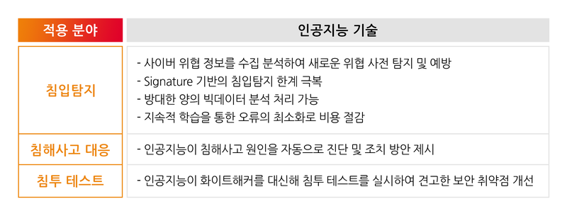
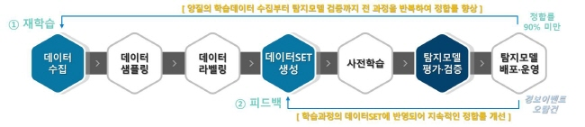

# 10.09 멘토링 

## 프로젝트 선정
### 목차
1. 주제선정회의 (50분) 
2. 관련조사와 시장조사 (50분)
	- 각자 조사 수행. 유사 서비스, 관련 인공지능 유사 BM
3. 2번에 대한 리뷰
4. 프로젝트 범위산정 (50분)
5. 프로젝트 준비_자료 간략하게 작성
6. 프로젝트 준비자료에 대한 리뷰 및 발표
7. 주제들에 대해서 리뷰
8. 각 프로젝트 주제 강평

### 9시 30분 (인공지능 보안 서비스) 검색...
* 인공지능 적용 기술

* 지도학습 탐지모델

* 관제
* 분석
* 대응
* 침투!
* 자동화(?), 능동적 학습, 비지도학습
* 행위기반의 이상행위 탐지
* 샌드박스(인기가 없다, 주요하지 않다.)
* 휴리스틱 검색

* '인공지능 적용 기술' 참고 : https://m.blog.naver.com/skinfosec2000/221867999090
* '인공지능 기반 금융권 보안관제 동향 및 향후과제' 참고 : https://www.fsec.or.kr/common/proc/fsec/bbs/42/fileDownLoad/1089.do
* '지도학습 탐지모델' 참고 : https://byline.network/2020/05/19-109/

* 침입 이상탐지 및 침투 테스트 프로젝트
	- 네트워크 칩입 또는 악성코드 탐지
	- 샌드박스를 활용한 행위 기반의 침입이상탐지 AI 개발(행위 정보 수집, 군집화와 분분 기법 -> 학습한 악성코드 분류모델로 악성코드 유형 판단)
	- 놓치는 이상탐지는 휴리스틱 서치로 보안(샌드박스 우회 등)
	- 쌓인 데이터(침입이상탐지 AI)를 기반으로 침투 테스트 기능을 추가해 보안 취약점 개선(자가 진단, 홍보)
	- 하이브리드 - 자동화(?), 능동적 학습, 비지도학습이 뭔지 잘 모름
	- 대시보드, 시각화?
* 능력
	- 클라우드, 쿠버네틱스 구성 가능
	- AutoML table 사용 가능
	- 백엔드 비슷하게 구성 가능
	- 파이썬, C

### 주제 선정
정세영 - 악성코드 - 정세영 - 개발 멤버 희망
이현제 - 스팸필터 - 개발 멤버 희망 (웹/프로그래밍)
조상우 - 마스크 / 안면인식 - (개발)
한현정 - 네트워크 탐지 학습 (개발)
오정석 - 메일 보안 (기획)
황규희 - 안면인식  (개발)
홍민기 - FDS / 웹로그 이상행위 (개발)
황인혜 - FDS (개발 안됨) --> 블록체인 
벅쥰영 - 페이크리뷰 ( 개발 안됨)
권세아 - 개발안됨. ( 얼굴인식 )
임종철 - 악성코드 (개발)
신서래 - 뇌파 인증 ( 개발) 
김준섭 - 스팸문자 (개발어려움) -> 앱 고려
두소휘 - 안면인식-즁귝시장 조사(개발안됨)
```
안면인식 - 조상우, 이현제, 두소휘, 황인혜 ,김준섭
홈IoT보안 - 신서래, 홍민기, 정세영, 박준영, 황규희
악성코드 - 권세아, 한현정, 임종철, 오정석

```

## 주제
* 악성코드
- 정적 분석
	+ PE Header(라이브러리, 패킹 등)
- 동적 분석
	+ 실행시의 행위를 로깅
- 알려진 악성코드는 '바이러스 토탈'로 먼저 확인

* 2가지(정적,동적) 데이터가 필요
	- 웹로드 개발
	- 백신 개발

### OT(Operation Technology, 제조운영 기술)
* 딥러닝을 이용한 OT(Operational technology) 영역 악성코드 탐지 기술 개발(WinXP, Win7 대상)
	- 제조쪽은 '시그니처'사용이 어려움
	- 시그너저 없이 악성코드 찾기
	- 한달에 1번 업데이트
	- 일부만 만듦
* 32bit 바이너리를 대상을 탐지

## 역할(R&R)
* 팀장 : 
* 기획, 문서화 : 목차, 4 ~ 50장
* 학습 모델링자 : 알고리즘 선택, 구분할 기준 선택
* 개발 : 파이썬 이용, 바이너리 특징 추출을 개발, 엔진 개발(윈도우xp기준)
	- 더블클릭 -> 프로세스 정지시켜놓고(후킹) -> 메모리에서 파라미터를 뽑아 -> 머신에 던져줌
* 악성코드 분석


## 필요 기술
* github 개발 

## 정리
0. 협업 툴: Notion 에 정리. 
1. Scope : 악성코드 정적 분석 / PE와 DLL 보기 / CLI 로 만들고 - 이후 GUI 형태로 발전시키기
2. R&R : 
    - 회의록 작성 : 오정석
    - 바이너리 특징 추출을 개발
    - 프로세스 정지시키고 메모리에 파라미터 뽑기
    - 엔진 개발(윈도우xp기준)
3. 기간
4. 옵션
	- 플러그앤플레이 형식으로 USB를 꼽으면 바로 검사하도록
	- 구분자 정하기 
	- 모델링 및 학습시키기
	- 데이터 전처리 및 가공
 


## 중간 발표

## 최종 발표
* 12월 4일