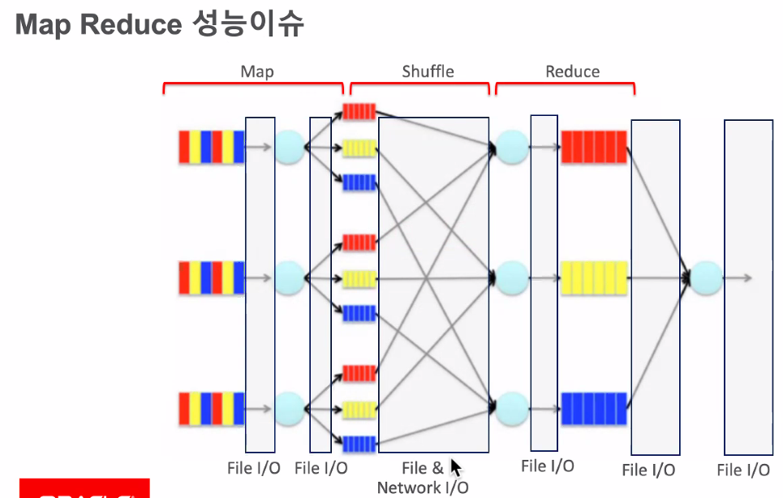

# Streaming Data Platform(Kafka) 김태완

## Data Lak

### 개념
* 데이터 저장소

### 빅데이터
* 내가 처리하기 어려운 많은 데이터

### Hadpoop & Spark
* 빅데이터 병렬 처리 툴

## 목표
* Hadoop의 특징 - HDFS와 MapReduce의  동작방식

* Spark의 특징과 동작 방식

### 참고
* https://m.blog.naver.com/acornedu/221083892521

## Hadoop 시작 : Search Engine
* 크롤러가 필요
	+ nutch가 html 로우 데이터를 수집함
* 웹 크롤링 후 파일 전처리 및 HTML 제거 -> 리버스 인덱스로 변환
	- 위치를 통해, 검색 엔진으로 사용
	
## Hadoop HDFS: Data Locality
* Data Node와 Managed Node가 필요
* Managed Node
	- MySQL, Resource Manager, Name Node
	- 보통 이중화로 구성
* 저장 방식 
	- 로우 데이터 2Gbyte
	- 256Mbyte * 8
	- 3개로 복사(8 * 3)후 노드에 분산 저장
	- 분산된 노드들은 File System HDFS 라 불림

* Programming Model: MapReduce
	- 데이터가 있는 곳에서 모아서 처리함
	- (키:리스트)로 처리해줌

### MapReduce 데이터 흐름

## Spark의 특징

* RDD: Lazy - 느긋한 실행은 부담을 줄임
	- 명령들은 뭘할지 기록만할 뿐, 실제 실행은 '액션'이 있을때만 함
* cpu에 대한 낭비를 줄이고, 병렬, 분산처리를 하게 만듦

* Datasets
	- RDD : 정형되지 않는 로우 데이터
	- Data Frame, Spark SQL : 정형화된 데이터

### 참고
* http://www.slideshare.net/JunKim22/spark-zeppelin

## 정리
* Hadoop으로 온프레미스에서 빅데이터 병렬 분산 처리 가능
	- data Locality 중요하게 생각함
* MapReduce의 단점으로
	- Spark이 등장
		+ 메모리 중심으로 동장(RDD)

* 데이터 분석가 : Hadoop, Spark 별로임
* 데이터 전처리, 전처리 : Hadoop, Spark을 많이 사용함
* 클라우드에서는 : Hadoop을 사용안함

---
